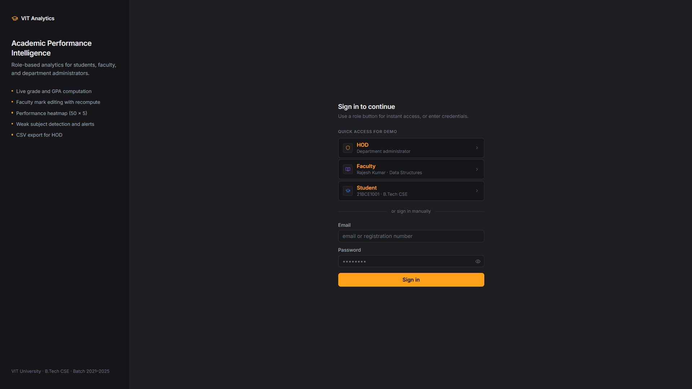
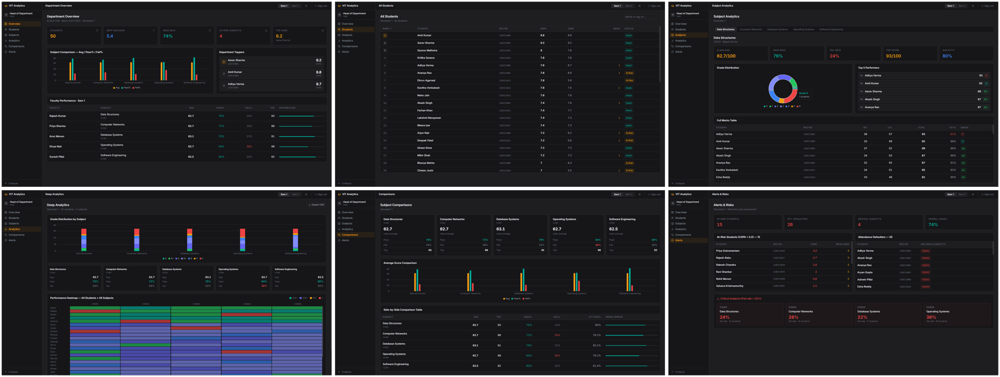

# Academic Performance Intelligence Platform (APIP)

**Version:** v1.0.0 &nbsp;|&nbsp; **License:** MIT &nbsp;|&nbsp; 🌐 [Live Demo](https://apip-dashboard.vercel.app/)

A browser-based **role-based academic analytics dashboard** built with React 18, TypeScript, and Zustand. APIP transforms static academic results into **actionable decision intelligence** for Students, Faculty, and HODs — with all analytics computed entirely client-side using a pure TypeScript engine.

---

## 📸 Screenshots

### Login Screen


### HOD Dashboard


### Faculty Dashboard


### Student Dashboard


---

## The Problem This Solves

Most academic portals are marks viewers. APIP is built around a different question for each role:

| Role | Question APIP answers |
|---|---|
| Student | Where am I underperforming and how do I fix it? |
| Faculty | How is my subject performing across the class? |
| HOD | Which subjects or faculty need intervention? |

---

## Features

**Authentication & Access Control**
- Role-based login: Student (via Registration Number), Faculty (via institutional email), HOD
- Strict route-level and data-level permission enforcement per role

**Analytics Engine**
- Live SGPA / CGPA recomputation (credit-weighted)
- Real-time rank recalculation across the class
- Automatic fail logic for attendance below 75%
- Subject-level grade distribution analytics
- Performance heatmap (50 × 5 optimized grid)

**Faculty Tools**
- Mark editing with instant analytics recompute across all dependents
- CSV export via client-side Blob API

**UX & Performance**
- Light / dark theme with localStorage persistence
- Skeleton loading states
- Smooth sidebar collapse animation (60fps)
- Interaction latency under 100ms
- Zero layout shift during navigation
- Zero console warnings

---

## Tech Stack

| Category | Technology |
|---|---|
| UI Framework | React 18 |
| Language | TypeScript |
| State Management | Zustand |
| Bundler | Vite |
| Styling | Tailwind CSS v3 |
| Persistence | localStorage |
| Data Export | Blob API (client-side CSV) |

---

## Architecture

APIP is intentionally structured around a clean separation of concerns in 8 files:

```
src/
├── main.tsx          # Entry point
├── App.tsx           # Routing and layout shell
├── store.ts          # Zustand global state
├── analytics.ts      # Pure TypeScript analytics engine
├── data.ts           # Static data and seed records
├── components.tsx    # Shared UI components
├── dashboards.tsx    # Role-specific dashboard views
└── styles.css        # Global styles
```

**Why this structure?**
Keeping analytics isolated in `analytics.ts` means the computation logic is fully testable and has no UI dependency. The Zustand store drives recomputation — when a faculty member edits a mark, the store triggers `analytics.ts` to recompute grades, ranks, and distributions atomically, and all consumers update in a single pass.

---

## Demo Credentials

### HOD
```
Email:    btechcsehod@vit.ac.in
Password: hodpass
```

### Faculty
```
Email:    <fullname lowercase>@vitfaculty.ac.in
Example:  rajeshkumar@vitfaculty.ac.in
Password: any 5+ characters
```

### Student
```
Registration Number: e.g. 21BCE1001
Password: any 5+ characters
```

---

## Run Locally

```bash
npm install
npm run dev
```

Production build:

```bash
npm run build
npm run preview
```

---

## Deployment

Fully client-side — no backend, no environment variables. Works offline after first load. Deploy anywhere:

- [Vercel](https://vercel.com) — recommended
- [Netlify](https://netlify.com)
- Any static hosting provider
